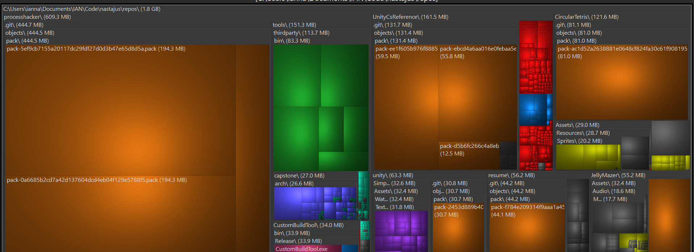
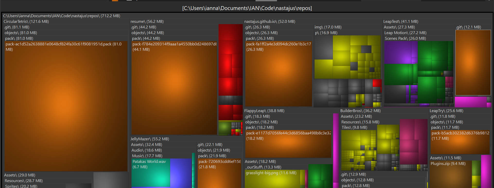
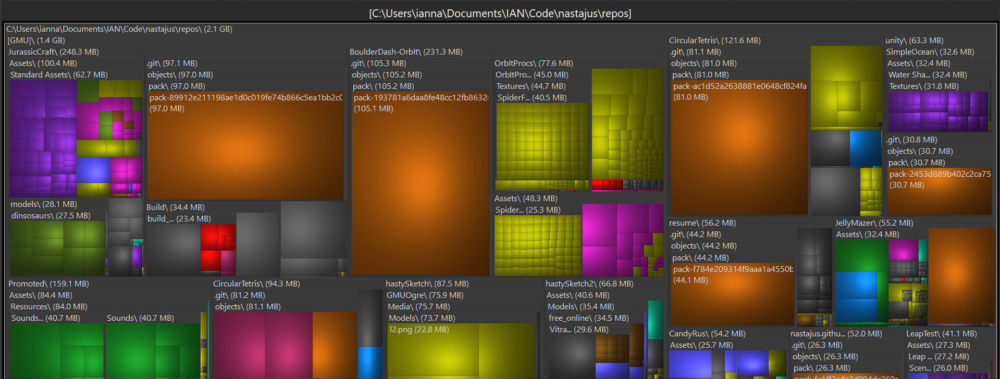

# TRN

## TRN-01

### Prompt (verbatim)

```
can you download all my github repositories, extract all of their commit messages, dates, sizes, put it all that raw data into a file, like json or csv or both? then i want an html file generated that links to all the github repos both remotely with https urls, and locally in this folder, and make navigation work in a webpage such as index.html.    then use that file to build a heatmap visualization of all my commits. i guess it can emulate the same design that github uses, but be an aggregate by showing all years in a single page. i'd like the various shades of green squares to be interactively clickable, so that once clicked it can show all the commits that day, and again link to both local filesystem folders and remote github repos. this includes private ones. private ones are to be distinguished clearly in the webpage you're making.  create a file to track these architecture decisions you're making, ADR.MD and put any comments in it formatted under ADR-01 for this first entry. ensure to format nicely.  create a TRN.MD file, and in it record under TRN-01 a transcript of this prompt, both a verbatim copying of my prompt exactly, then followed by a summary of your actions taken.  create a RUN.MD file, add an try RUN-01, describing how this session of agentic coding went, what worked/failed, any feedback you may have about this project for me, such as advice, suggestions, etc, not covered in other two MD files.  
```

### Actions Taken (summary)
- Used `gh` to list all repositories (including private) and cloned them into `repos/`, then fetched updates.
- Extracted commit metadata with `git log --all` and wrote raw data to `data/commits.json`, `data/commits.csv`, `data/repos.json`, and `data/repos.csv`, plus JS data files for the HTML page.
- Built `index.html` with an all-years heatmap, clickable day details, and repo cards with local + remote links and clear private labels.
- Authored `ADR.MD`, `TRN.MD`, and `RUN.MD` documentation.

## TRN-02

### Prompt (verbatim)

```
there's a large number of unexpected commits filling up most the last 5 years, that shouldn't. it seems you've imported git repos that i didn't make with processhacker. i'm unsure if there's others, but that one alone pollutes everything. i need you to remove it, and udpate the index.html accordingly.  are you able to distinguish on the command line that a repo is forked or not? if you can, can you remove all such from from the contributions? you can still list it at the end as a fork. there should perhaps be a few others i'd forked too, but those i will want to track, so first i need to see which ones they are. if you can't see forking status, try to propose to me another solution .   update the ADR, RUN and TRN files with appropriate -02 entries, following the same pattern as earlier -- that is, appending a new section with XYZ-02 in each of those 3 files, and following the guidelines i set out earlier for each file.
```

### Actions Taken (summary)
- Verified fork status via `gh repo list --json isFork` and confirmed `processhacker` is a fork.
- Regenerated commit datasets excluding all forked repositories from the heatmap.
- Updated `index.html` to add a Forks section and remove forks from the main repo list and contributions.
- Appended ADR-02 and RUN-02 documentation entries.

### Addendum (WizTree snapshots)

These snapshots capture the initial repository download footprint (pre‑GMU), including a few very large repos removed because they consumed excessive disk space and did not reflect my contributions.




## TRN-03

### Prompt (verbatim)

```
OK So now some quality of life changes. First let's move the three markdowns into a subfolder named docs.   in the day details section,  there will be several changes.  for listing of each commit, first mention the repo  in a larger font.   then, rather than showing the private label next each commit, move it next to the repo name instead. whenever two or more repos appear in the same day, put the repo only once at the beginning The contiguous sequence of commits related to that repo.   also for the title day details, I want that to be a local, that once clicked, will take us back to showing the year heat map that matches the currently shown commit date. even a little bit animation to highlight the commit back inside the heat map would be nice as well. So I can see where it came from easily, when the view returns back to the heat map higher up in the index file.  similarly, when clicking one of the green squares in the yearly heat map, I want a local anchor that jumps down to the daily detail section as well.   also back in the day detail section, I want the commit messages to be all clickable, which would always take you that specific Commit on Github. also I want to be able to see any git message bodies beneath the git commit messages, and i want them to show 3 lines max unless clicked to expand view for that one commit message body, which will show the entire body. update all the markdown files appropriately, as before. 
```

### Actions Taken (summary)
- Moved `ADR.MD`, `TRN.MD`, and `RUN.MD` into `docs/`.
- Regenerated commit datasets to include commit bodies.
- Updated the day details UI to group by contiguous repo sequences, show repo headers with private tags, and add commit body expand/collapse.
- Added navigation between heatmap and details with anchor jumps and a highlight animation.

## TRN-04

### Prompt (verbatim)

```
you claim to have done updates as I've asked,, But all the data is gone from the index .Html. Discover the root cause and replace it so it's there again. Update markdowns to explain what happened.
```

### Actions Taken (summary)
- Verified that `data/commits.json` and `data/repos.json` still contained data.
- Found JavaScript operators in `index.html` were corrupted (`?:` replaced by `|`) which broke rendering.
- Restored the correct ternary and logical expressions and updated documentation with the root cause.

## TRN-05

### Prompt (verbatim)

```
Create a Read me file to explain what's going on. How this works, how it's updated, Any limitations. Update the run and transcribe files appropriately. 
```

### Actions Taken (summary)
- Added `README.md` describing the dashboard, update steps, structure, and limitations.
- Appended RUN-05 and TRN-05 entries.

## TRN-06

### Prompt (verbatim)

```
I've moved the folders around a bit. I want you to examine and see. Once you understand how they're moved around, I want you to update references so that they work. Forexampleindex.Html links would be broken locally now. I'm not sure if anything else is. Please update all relevant markdown files appropriately.
```

### Actions Taken (summary)
- Detected the dashboard now lives under `Overview/` while `repos/` stayed at the root.
- Updated `data/*.json`, `data/*.csv`, and `data/*.js` to point local repo links to `../repos/`.
- Updated `Overview/README.md` and appended ADR/RUN/TRN entries.

## TRN-07

### Prompt (verbatim)

```
for this overview folder, create a repo inside it, and create a logical series of commits. try to back date them according to file dates, but A Coherent narrative history is more relevant And more important than doing an individual commit for every unique file date. instead Thematic group and Justice pick a relevant date for that scope of that thematic group of changes. try to use at least a bit of Descriptive language in the commits. I'm not particularly attached to any of terms per se.  publish a repo at nastajus-github-overview. Update the Run and transcribe markdowns.
```

### Actions Taken (summary)
- Initialized a Git repository in `Overview/` and created three thematic, backdated commits.
- Published the repository to GitHub as `nastajus-github-overview` (private) and pushed `master`.
- Appended RUN-07 and TRN-07 entries.

## TRN-08

### Prompt (verbatim)

```
i want a change such that, when a project's name is clicked, in either the day details section, or the respositories section, that what happens is the all years heatmap enters into a modified state. i want to see only the green squares that relevant commits be clearly distinguishable. it can be an oversized outline, a brighter color, perhaps yellow, idk. it can pulsate more obviously, perhaps when hovered over.  all non-commit related days should dim, darken, become a less-visible but still visible color. idk. gray? black? a color that stands out less than the current green.  so while in this state, it becomes really clear which days are the commit related days.  this alternate view mode should have an easy obvious way to cnacel it. i'm unsure how. idk if i want to say by clicking anyehwre, or by having a button. try to pick an easy way.  it should be able to revert back to the full view. also once a project name is clicked, the view can snap back up to begin showing the earlist year that has commits.

update all 3 markdowns appropriately.
```

### Actions Taken (summary)
- Added a project filter mode that highlights only commit days for the selected repo and dims all others.
- Made repo names clickable in Day Details and Repositories to activate the filter.
- Added a visible "Clear filter" control and auto-scroll to the earliest year with commits.
- Appended ADR-06, RUN-08, and TRN-08 entries.

## TRN-09

### Prompt (verbatim)

```
this looks great. i'm very pleased. commit this. 

the clear filter button needs more visibility. make it stand out colorfully more. 

now another feature i'd like. when in the unfiltered view, when hoevering over a squre, a tooltip appears. idk if you can use newlines in there, but if so, add bullets for each project underneath the number of commits.

i'm also interested in another more robust feature, which may compete with the last a bit. i suppose they might both coexist fine. i want to experiment with an alternate mode/pathway that triggers when you click a square. currently it just jumps down to the list of commits. now i want another thing to happen.  when i click a single square, instead of jumping down right away to the list of commits, first i'd like to see a local popup near the box that lists all the projects committed taht day.  but also, i want unique nice colors assigned to distinguish each project. and then i want all the related squares that contain commits of those projects to show up in those project colors. so some challenges with this need to be resolved. one is that when other boxes contain multiple projects, what color to assign? is there a way you can change those boxes to show some triangles to encapsulate all unique colors for that day? another challenge will be consistency of colors as one clicks across different days. ideally the same color is only used once per project, and doesn't collide with any other project in the same overlapping time. i think reusing colors is fine, but it can never repeat in any day where two projecst use the same color.  i don't know how many unique colors you'd need, but i imagine it can be small, anywhere from 3-6 is my estimate.  i highly doubt more are needed, but i can't be sure until you analyze and tell me. i want the colors chosen to all be pleasing, and to be the spread of the rainbow. perhaps all pastels, idk. 

build it if you can. describe limitations if any where appropriate. update the usual markdowns.
```

### Actions Taken (summary)
- Made the clear filter button more prominent and colorful.
- Added hover tooltips in unfiltered view with commit counts and per-day project lists.
- Implemented day-focus mode with project color highlighting, conic gradients for multi-project days, and a popup with actions.
- Added ADR-07, RUN-09, and TRN-09 entries.

## TRN-10

### Prompt (verbatim)

```
what's best practice with vscode folder?
overall quite good. just, when there is a popup, i want to be able to click the project name to see the commits for that project. right now when there's two+ projects, and i click view commits, it's not clear which (or both?!) are being seleced. i want to be able to clearly click one project and highlight those particular commit days.
update markdowns, transcribe, etc.
```

### Actions Taken (summary)
- Added project-name buttons in the day popup that apply the repo filter and show project-specific commits.
- Clarified the popup action label to "View all commits".
- Appended ADR-08, RUN-10, and TRN-10 entries.

## TRN-11

### Prompt (verbatim)

```
OK so put a gitignore or whatever so I can stop seeing VS code come up as uncommitted unclean. 

in the pop up when I click the project it currently jumps down to the end of individual commits. That's not what I want. Instead I'd rather you snap to the beginning of first year in which commits exist. 

update markdowns.
```

### Actions Taken (summary)
- Added `.gitignore` entry to ignore `.vscode/`.
- Updated the popup project click action to filter and scroll to the earliest year with commits instead of jumping to details.
- Appended ADR-09, RUN-11, and TRN-11 entries.

## TRN-12

### Prompt (verbatim)

```
there's a github org at GameMakersUnion that has a majority of repos by me, perhaps all created by me, i'm unsure. i want those all downloaded into a folder [GMU] i've created. I want you to download all of the repositories there, at ../repos/[GMU] .  (1) I then want you to do the same kind of analysis on all of these commits, like he did the first time for my own personal account Nastajus, but on these new GMU ones. i want the data files updated to clearly distinguish the origin account. i see some have an owner field. i leave the semantics up to you.  the point is to clearlye easily ensure origin is identifyiable.  (2) I then want the commit history checkerboard to be updated to include these new entries, however, I need to ensure that visually distinct. use a pleasing shade of red to denote GMU squares, in place of the default green. it should have shades like the green does too to indicate frequency of commits or whatever. ensure it doesn't conflict by being too close to the selected colours. furthermore I want all projects to  clear distinguishing label with colours in the repository list in the index file to include them as well.  such as GMU / project, or project `GMU` in repo title line.  the GMU portion should be clickable such that it highlights and filters all GMU originating projects, and then I guess clicking it again can undo the filter and show everything again in the repositories list and the checkerboard.  

update appropriate markdowns. Commit new changes from this prompt. 
```

### Actions Taken (summary)
- Cloned all GameMakersUnion repos into `../repos/[GMU]/`.
- Regenerated data files to include GMU commits with origin metadata fields.
- Updated the heatmap to show GMU days in a red scale and added origin filter controls in the repo list.
- Appended ADR-10, RUN-12, and TRN-12 entries.

## TRN-13

### Prompt (verbatim)

```
so for these two unexpected PNG files, I want you to create a new section at the end of TRN-02 and embed these images. they're generated from Wiz tree. briefly summarize their contents overview in the TRN-02 new section. they give an overview of all the downloaded repositories initially, before GMU, With a few of them removed because they were excessively large in file space consumption, and did not reflect any contributions in mine.  

ensure to continue to update markdowns with new relevant entries. Such as this transcription should also be a new Entry reflecting the back filling of an old entry.
```

### Actions Taken (summary)
- Added a TRN-02 addendum with WizTree snapshots and a brief summary.
- Appended this TRN-13 entry to record the backfill request.

## TRN-14

### Prompt (verbatim)

```
somehow an accidental copy of these images came back to the root level. And I think they became referenced. I deleted them. This broke the TRN.MD references. There should only be a single copy of these repo 1 and repo 2 files inside Overview\docs\trn . Ensure that they remain the only ones. Now rename them prepending with `wiztree-` ensure that the backfilled addendum TRN-02 entry now correctly references these updated named images. 

there is now a new Wiztree 3 file, as well, in the same path, this now reflects total repo sizes of all my personal account repos alongside the organizational account of Game Makers Union. Please create a new TRN entry to summarize the reference to this image as well. Use the same structure as TRN-02, by appending a new section for this image. 

transcribe and commit as normal.
```

### Actions Taken (summary)
- Renamed WizTree images with a `wiztree-` prefix and updated TRN-02 addendum paths.
- Added a new TRN-14 addendum section referencing the combined personal + GMU snapshot.

### WizTree Snapshot (personal + GMU)

This snapshot captures the combined repo size footprint for personal (Nastajus) and GMU repositories.


